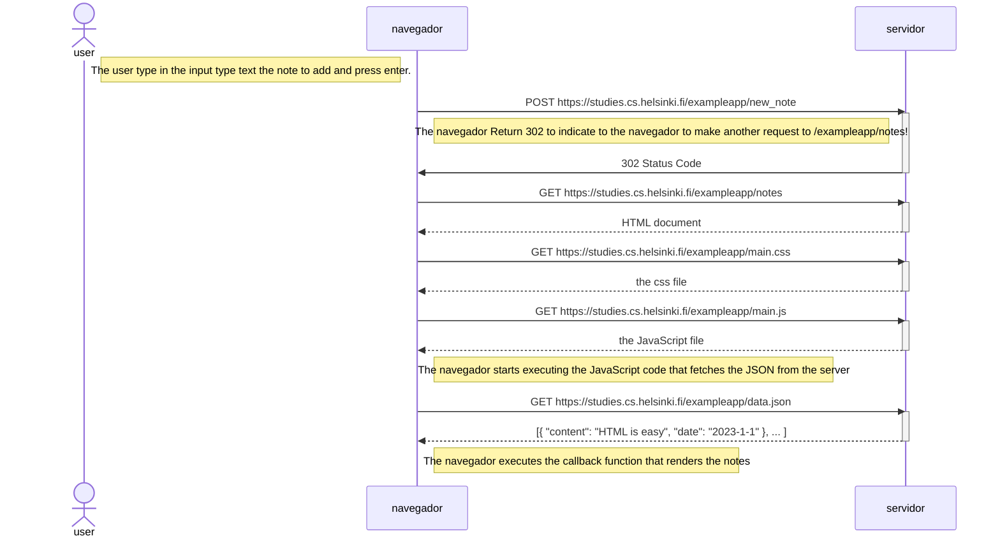
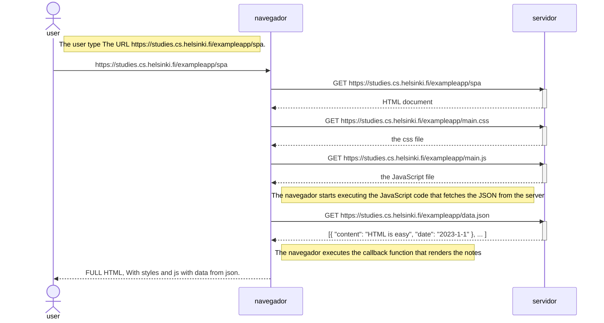
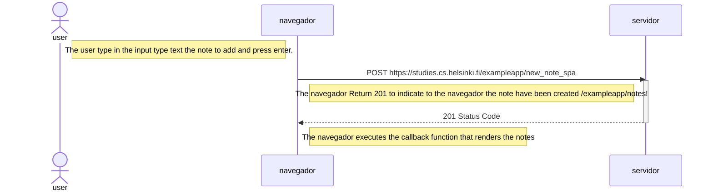

# fullstackopen
Main repository to upload the exercises and homework of the bootcamp.

### 0.4: Diagrama de Secuencia hecho en mermaid.js.org.

### 0.5: Diagrama de Secuencia mermaid https://studies.cs.helsinki.fi/exampleapp/spa.

### 0.6: Diagrama de Secuencia mermaid https://studies.cs.helsinki.fi/exampleapp/spa when user create send a new note.

